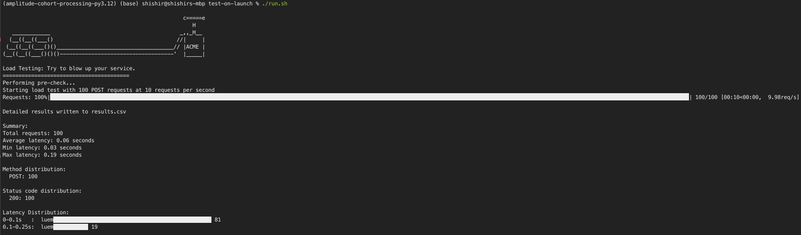

# HTTP Load Testing Script



## Overview

This Python script is a versatile, rate-limited HTTP load testing tool designed for API performance testing and analysis. It supports both GET and POST requests, offers customizable JSON payloads, and provides detailed output including latency distribution charts.

## Features

- Support for GET and POST HTTP methods
- Rate limiting to control request frequency
- Multiple URL testing capability
- JSON template support with random value generation
- Dynamic JSON response extraction
- Pre-check functionality to verify endpoints before full testing
- Real-time progress monitoring
- Detailed CSV output for in-depth analysis
- Summary statistics with visual latency distribution chart
- Asynchronous operation for improved performance

## Installation

1. Ensure you have Python 3.7 or later installed.
2. Clone this repository:
   ```
   git clone https://github.com/yourusername/http-load-tester.git
   cd http-load-tester
   ```
3. Install the required dependencies:
   ```
   pip install aiohttp tqdm jsonpath-ng termgraph
   ```

## Usage

Basic syntax:

```
python load_tester.py <URL> [OPTIONS]
```

### Options

- `--method`: HTTP method to use (GET or POST, default: GET)
- `--json-template`: JSON template for request body (for POST requests)
- `--json-paths`: JSON paths to extract from response
- `--rate`: Rate limit in requests per second (default: 10)
- `--requests`: Total number of requests to make (default: 100)
- `--output`: Output CSV file name (default: load_test_results.csv)

### Examples

1. Simple GET request:
   ```
   python load_tester.py https://api.example.com/endpoint
   ```

2. POST request with JSON template:
   ```
   python load_tester.py https://api.example.com/endpoint --method POST --json-template '{"key": "{{random_string}}", "value": {{random_int}}}'
   ```

3. Extracting specific values from JSON response:
   ```
   python load_tester.py https://api.example.com/endpoint --json-paths "$.id" "$.status" "$.data.name"
   ```

4. Combining multiple options:
   ```
   python load_tester.py https://api.example.com/endpoint --method POST --json-template '{"user": "{{random_string}}"}' --json-paths "$.response.id" "$.response.status" --rate 5 --requests 50 --output custom_results.csv
   ```

### JSON Path Examples

Here are some examples of JSON paths and what they extract:

1. `$.id`: Extracts the `id` field from the root of the JSON response
2. `$.user.name`: Extracts the `name` field from the `user` object
3. `$.items[0].price`: Extracts the `price` field from the first item in the `items` array
4. `$.*.id`: Extracts all `id` fields from any object in the root
5. `$..price`: Extracts all `price` fields anywhere in the JSON structure
6. `$.users[?(@.active==true)].name`: Extracts names of all active users

## Output

The script provides two types of output:

1. A CSV file containing detailed information about each request, including:
   - URL
   - HTTP method
   - Status code
   - Latency
   - Request details
   - Response (truncated)
   - Extracted JSON values (if specified)

2. A summary in the console, including:
   - Total requests
   - Average, minimum, and maximum latency
   - HTTP method distribution
   - Status code distribution
   - A visual bar chart of latency distribution

## Contributing

Contributions are welcome! Please feel free to submit a Pull Request.

## License

This project is licensed under the MIT License - see the [LICENSE](LICENSE) file for details.
